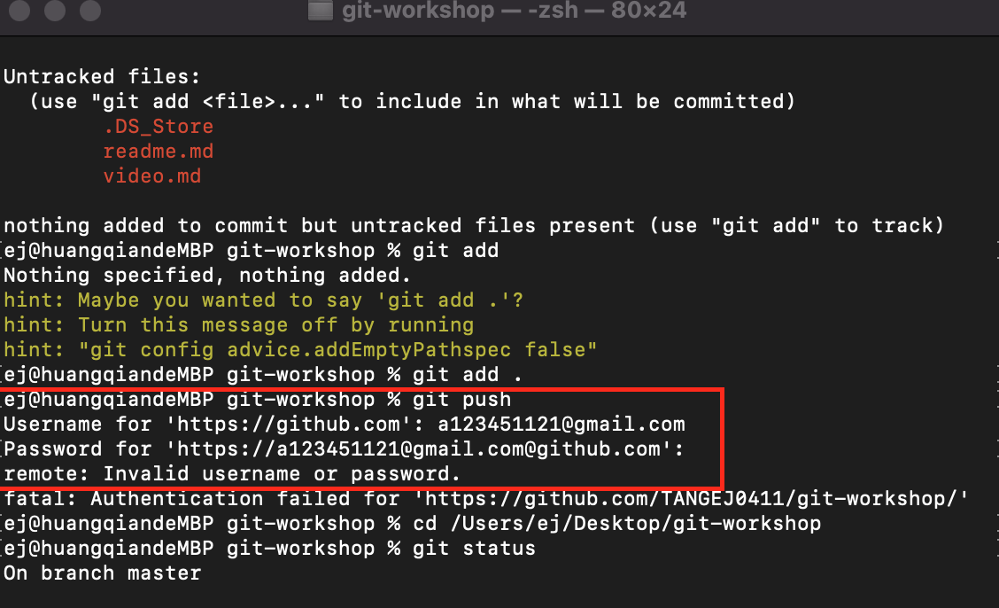

## 上課心得
上課時很深刻的感受到老師對教學的熱情，會產生老師都這麼有熱情了．那我的熱情怎麼可以書給老師，會更用心的學習XD，會觀察同學的進度來改變教學的速度和進度，在學習時也比較不會產生被丟下的無力感．   
## 想要詢問老師
另外想要向老師詢問：如果想要練習陣列method的寫法時，我們要自訂一個方法有需要把他變成一個物件把方法寫在裡面，像下面這樣子在自己定義自己的方法嗎，因為不太清楚陣列的method運作模式是不是這樣子，還是有其他方法，所以才有此一問，謝謝老師！

```javascript
let arr2=[6,7,8,9];
let arr={
    arr:[1,2,3,4,5],
    concat: function(arr){
        console.log(this.arr);
        console.log(arr);
    }
}
arr.concat(arr2);
```

## git的問題

可以clone或是pull下來，但是只要要push上去就會需要輸入username和password我嘗試了username輸入我的信箱和github帳號，密碼輸入設定金鑰時的密碼和github的密碼都無法成功